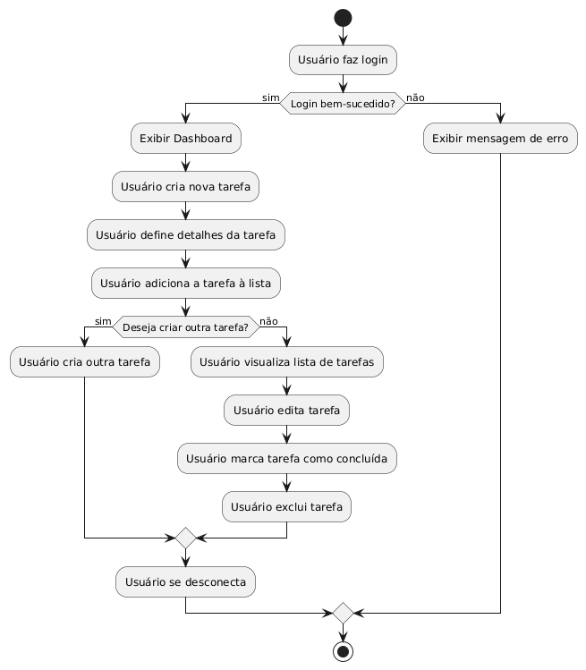

# Escopo do Projeto: O que Vamos Fazer

## 1. Escopo Funcional

O sistema deve:

### Gerenciar Tarefas
- Permitir que o usuário adicione, edite e remova tarefas.
- Definir prioridades (alta, média, baixa) para cada tarefa.
- Categorizar tarefas em diferentes listas ou projetos.
- Marcar tarefas como concluídas.
- Definir prazos e lembretes para tarefas.

### Autenticação e Perfil de Usuário
- Permitir que o usuário crie uma conta e faça login/logout.
- Permitir a recuperação de senha.
- Gerenciar preferências de usuário, como temas e notificações.

### Visualização e Filtros
- Exibir tarefas em uma lista, calendário ou visão em Kanban.
- Permitir filtros por status (concluído, pendente), data, prioridade e categoria.

### Integrações
- Sincronizar com calendários externos (Google Calendar, Outlook).
- Exportar listas para formatos como CSV ou PDF.

## 2. Escopo Não Funcional

O sistema deve:

### Desempenho
- Carregar a lista de tarefas com menos de 1 segundo para listas com até 100 tarefas.
- Sincronizar dados em tempo real ao adicionar, editar ou excluir uma tarefa.

### Usabilidade
- Ser intuitivo e fácil de usar, com uma curva de aprendizado baixa.
- Ser responsivo, funcionando bem em dispositivos móveis e desktops.

### Segurança
- Utilizar autenticação segura com encriptação de senhas.
- Proteger dados do usuário contra acessos não autorizados.

### Escalabilidade
- Suportar até 10.000 usuários simultâneos sem perda de desempenho.

### Compatibilidade
- Funcionar em navegadores modernos (Chrome, Firefox, Safari, Edge).
- Ser compatível com múltiplos dispositivos e sistemas operacionais.

## 3. Objetivos SMART

- **Específico (Specific)**: Implementar uma aplicação de lista de tarefas com funcionalidades de criação, edição e gerenciamento de tarefas, incluindo integração com calendários externos.
- **Mensurável (Measurable)**: O sistema deve ser capaz de suportar 1.000 usuários ativos no primeiro mês, com uma taxa de conclusão de tarefas de 70%.
- **Atingível (Achievable)**: Desenvolver a aplicação em 3 meses, utilizando tecnologias já dominadas pela equipe, como React e Node.js.
- **Relevante (Relevant)**: Melhorar a produtividade dos usuários ao fornecer uma ferramenta eficaz para o gerenciamento de tarefas diárias.
- **Temporal (Time-bound)**: Lançar a versão beta em 2 meses e a versão final em 3 meses.

## 4. Cronograma (Diagrama de Gantt)

O cronograma do projeto incluirá as seguintes etapas:

- Planejamento e Análise de Requisitos (1 semana)
- Design do Sistema (2 semanas)
- Desenvolvimento Back-end (3 semanas)
- Desenvolvimento Front-end (3 semanas)
- Integração e Testes (2 semanas)
- Documentação e Preparação para Lançamento (1 semana)
- Lançamento Beta (1 semana)
- Ajustes e Melhorias com Base no Feedback (2 semanas)
- Lançamento Final (1 semana)

## 5. Análise de Risco

- **Risco de Atraso no Desenvolvimento**: Mitigar com sprints semanais e revisões de progresso.
- **Segurança de Dados**: Implementar e testar rigorosamente medidas de segurança desde o início do desenvolvimento.
- **Compatibilidade e Usabilidade**: Realizar testes em diferentes dispositivos e navegadores durante a fase de desenvolvimento.
- **Escalabilidade**: Monitorar o desempenho do sistema com usuários simulados durante a fase de testes.

## 6. Recursos

- **Equipe**: Desenvolvedores Full-Stack (2), Designer UX/UI (1), Analista de Testes (1).
- **Tecnologias**: React, Node.js, MongoDB, Express, Docker.
- **Orçamento**: $20.000 para desenvolvimento, teste e lançamento.
- **Ferramentas**: GitHub para versionamento, Jira para gerenciamento de projetos, Slack para comunicação, Figma para design.
Diagrama de Classes:

Diagrama de Casos de Uso:

Diagrama de Fluxo:

